# Platform Gateway - データベースER図

## 概要

Platform Gatewayは、マルチテナント対応のエンタープライズ管理プラットフォームです。
本ER図は、システムの核となるデータベース構造を表現しています。

## データベース設計思想

- **マルチテナンシー**: 複数の組織（テナント）を1つのプラットフォーム上で管理
- **セキュリティファースト**: API キー、監査ログ、セッション管理を重視
- **統合性**: Keycloak (認証)、Stripe (決済) との連携を考慮
- **スケーラビリティ**: 使用量追跡、レート制限対応

---

## ER図 (Entity Relationship Diagram)

```mermaid
erDiagram
    %% Core Entities
    tenants ||--o{ users : "has"
    tenants ||--o{ api_keys : "owns"
    tenants ||--o{ payment_methods : "has"
    tenants ||--o{ invoices : "receives"
    tenants ||--o{ usage_records : "tracks"
    tenants ||--o{ audit_logs : "logs"
    tenants ||--o{ invitations : "creates"
    tenants ||--o{ webhooks : "configures"
    
    %% User Relations
    users ||--o{ user_sessions : "creates"
    users ||--o{ api_keys : "owns"
    users ||--o{ audit_logs : "performs"
    users ||--o{ invitations : "sends"
    users ||--o{ invitations : "accepts"

    %% テナント (組織) - プラットフォームの基本単位
    tenants {
        TEXT id PK "テナントID (例: tenant-abc-corp)"
        TEXT name "組織名"
        TEXT domain UK "ドメイン名 (abc-corp.com)"
        TEXT status "ステータス: active/suspended/trial/inactive"
        TEXT plan "プラン: starter/professional/enterprise/custom"
        TEXT keycloak_realm "Keycloak レルム名"
        TEXT stripe_customer_id "Stripe 顧客ID"
        TEXT stripe_connect_account_id "Stripe Connect アカウント"
        TEXT billing_email "請求先メールアドレス"
        TEXT billing_address "請求先住所"
        TEXT billing_country "請求先国"
        REAL monthly_price "月額料金"
        TEXT currency "通貨 (USD, JPY, etc.)"
        TEXT next_billing_date "次回請求日"
        INTEGER max_users "最大ユーザー数"
        INTEGER max_api_calls_per_month "月間APIコール上限"
        REAL max_storage_gb "ストレージ上限(GB)"
        TEXT settings "設定 (JSON形式)"
        TEXT created_at "作成日時"
        TEXT updated_at "更新日時"
    }

    %% ユーザー - プラットフォーム利用者
    users {
        TEXT id PK "ユーザーID (例: user-123)"
        TEXT tenant_id FK "所属テナントID"
        TEXT keycloak_user_id UK "Keycloak ユーザーID"
        TEXT email "メールアドレス"
        TEXT name "表示名"
        TEXT avatar "アバターURL"
        TEXT status "ステータス: active/inactive/suspended/pending"
        TEXT roles "ロール配列 (JSON): admin/tenant_owner/manager/developer/user"
        BOOLEAN email_verified "メール認証済み"
        TEXT last_login_at "最終ログイン日時"
        INTEGER login_count "ログイン回数"
        TEXT created_at "作成日時"
        TEXT updated_at "更新日時"
    }

    %% ユーザーセッション - ログイン状態管理
    user_sessions {
        TEXT id PK "セッションID"
        TEXT user_id FK "ユーザーID"
        TEXT tenant_id FK "テナントID"
        TEXT token_hash "JWTトークンハッシュ"
        TEXT refresh_token_hash "リフレッシュトークンハッシュ"
        TEXT ip_address "IPアドレス"
        TEXT user_agent "ユーザーエージェント"
        TEXT created_at "作成日時"
        TEXT expires_at "有効期限"
        TEXT last_activity_at "最終アクティビティ"
    }

    %% APIキー - プログラマティックアクセス
    api_keys {
        TEXT id PK "APIキーID"
        TEXT tenant_id FK "テナントID"
        TEXT user_id FK "作成ユーザーID"
        TEXT name "キー名称"
        TEXT key_hash UK "キーハッシュ"
        TEXT key_prefix "キープレフィックス (表示用)"
        TEXT permissions "権限配列 (JSON): read/write/admin"
        INTEGER rate_limit_per_hour "時間当たりレート制限"
        BOOLEAN is_active "有効フラグ"
        TEXT last_used_at "最終使用日時"
        INTEGER usage_count "使用回数"
        TEXT created_at "作成日時"
        TEXT expires_at "有効期限"
    }

    %% 決済方法 - Stripe 連携
    payment_methods {
        TEXT id PK "Stripe 決済方法ID"
        TEXT tenant_id FK "テナントID"
        TEXT type "タイプ: card/bank_account"
        TEXT brand "ブランド: visa/mastercard/amex"
        TEXT last4 "末尾4桁"
        INTEGER expiry_month "有効期限月"
        INTEGER expiry_year "有効期限年"
        BOOLEAN is_default "デフォルト決済方法"
        BOOLEAN is_active "有効フラグ"
        TEXT created_at "作成日時"
        TEXT updated_at "更新日時"
    }

    %% 請求書 - 課金管理
    invoices {
        TEXT id PK "Stripe 請求書ID"
        TEXT tenant_id FK "テナントID"
        TEXT number "請求書番号"
        TEXT status "ステータス: draft/open/paid/void/uncollectible"
        INTEGER amount_due "請求金額 (cents)"
        INTEGER amount_paid "支払済金額 (cents)"
        TEXT currency "通貨"
        TEXT created_date "請求書作成日"
        TEXT due_date "支払期日"
        TEXT paid_date "支払完了日"
        TEXT stripe_data "Stripe メタデータ (JSON)"
        TEXT created_at "作成日時"
        TEXT updated_at "更新日時"
    }

    %% 使用量レコード - リソース使用量追跡
    usage_records {
        TEXT id PK "使用量レコードID"
        TEXT tenant_id FK "テナントID"
        TEXT period_start "集計期間開始"
        TEXT period_end "集計期間終了"
        INTEGER api_calls "APIコール数"
        REAL storage_gb "ストレージ使用量(GB)"
        INTEGER active_users "アクティブユーザー数"
        TEXT custom_metrics "カスタムメトリクス (JSON)"
        TEXT created_at "作成日時"
    }

    %% 監査ログ - セキュリティとアクティビティ追跡
    audit_logs {
        TEXT id PK "ログID"
        TEXT tenant_id FK "テナントID"
        TEXT user_id FK "実行ユーザーID"
        TEXT action "アクション: user.login/api_key.created/invoice.paid"
        TEXT resource "リソースタイプ: user/api_key/tenant"
        TEXT resource_id "リソースID"
        TEXT ip_address "実行IPアドレス"
        TEXT user_agent "ユーザーエージェント"
        TEXT metadata "追加メタデータ (JSON)"
        TEXT created_at "実行日時"
    }

    %% 招待 - ユーザー招待管理
    invitations {
        TEXT id PK "招待ID"
        TEXT tenant_id FK "テナントID"
        TEXT invited_by FK "招待者ユーザーID"
        TEXT email "招待先メールアドレス"
        TEXT roles "付与ロール配列 (JSON)"
        TEXT status "ステータス: pending/accepted/expired/revoked"
        TEXT token UK "招待トークン"
        TEXT expires_at "有効期限"
        TEXT accepted_at "承諾日時"
        TEXT accepted_by FK "承諾ユーザーID"
        TEXT created_at "作成日時"
    }

    %% Webhook - 外部連携
    webhooks {
        TEXT id PK "Webhook ID"
        TEXT tenant_id FK "テナントID"
        TEXT name "Webhook 名称"
        TEXT url "エンドポイントURL"
        TEXT secret "共有秘密鍵"
        TEXT events "監視イベント配列 (JSON)"
        BOOLEAN is_active "有効フラグ"
        INTEGER success_count "成功回数"
        INTEGER failure_count "失敗回数"
        TEXT last_success_at "最終成功日時"
        TEXT last_failure_at "最終失敗日時"
        TEXT created_at "作成日時"
        TEXT updated_at "更新日時"
    }
```

---

## 主要エンティティ詳細

### 🏢 Tenants (テナント)
- **目的**: マルチテナント構成の基本単位
- **特徴**: 
  - 独立したドメインと請求設定
  - Keycloak Realm、Stripe Customer との1:1関連
  - 使用量制限とプラン管理
  - 設定のJSON格納による柔軟性

### 👥 Users (ユーザー)
- **目的**: プラットフォーム利用者管理
- **特徴**: 
  - テナント内でのロールベースアクセス制御
  - Keycloak連携による認証統合
  - アクティビティトラッキング
  - 複数ロール対応 (JSON配列)

### 🔑 API Keys (APIキー)
- **目的**: プログラマティックアクセス制御
- **特徴**: 
  - テナント・ユーザー毎の細かい権限設定
  - レート制限対応
  - 使用量トラッキング
  - 安全なハッシュ化ストレージ

### 💳 Payment Methods (決済方法)
- **目的**: Stripe決済連携
- **特徴**: 
  - 複数決済方法対応
  - デフォルト決済方法管理
  - カード情報の安全な格納

### 📊 Usage Records (使用量レコード)
- **目的**: リソース使用量の正確な追跡
- **特徴**: 
  - 期間毎の集計データ
  - 課金計算の基盤
  - カスタムメトリクス対応

### 🔍 Audit Logs (監査ログ)
- **目的**: セキュリティとコンプライアンス
- **特徴**: 
  - 全アクション履歴
  - IPアドレス・ユーザーエージェント記録
  - JSON形式の詳細メタデータ

---

## インデックス設計

パフォーマンス最適化のため、以下の観点でインデックスを設計：

### 🔍 検索パフォーマンス
- **テナント検索**: `domain`, `status`
- **ユーザー検索**: `email`, `tenant_id`
- **セッション検索**: `token_hash`, `expires_at`

### 📈 集計クエリ最適化
- **使用量集計**: `tenant_id`, `period_start/end`
- **監査ログ**: `tenant_id`, `action`, `created_at`
- **請求書**: `tenant_id`, `status`, `created_date`

### 🔗 外部キー最適化
- 全ての外部キー関係にインデックス設定
- カスケード削除とNULL設定の適切な使い分け

---

## セキュリティ考慮事項

### 🔒 データ保護
- **機密情報ハッシュ化**: APIキー、セッショントークン
- **PII データ**: メール、IP アドレスの適切な管理
- **監査ログ**: 全アクションの完全追跡

### 🛡️ アクセス制御
- **テナント分離**: 厳格なテナントID チェック
- **ロールベース**: JSON配列による柔軟な権限管理
- **API制限**: レート制限とスコープ制限

### ⚡ パフォーマンス
- **効率的インデックス**: 検索・集計クエリの最適化
- **適切な正規化**: データ整合性とパフォーマンスのバランス
- **JSONフィールド**: 柔軟性と検索性の両立

---

## 外部システム連携

### 🔐 Keycloak (認証)
- `tenants.keycloak_realm` → Keycloak Realm
- `users.keycloak_user_id` → Keycloak User

### 💰 Stripe (決済)
- `tenants.stripe_customer_id` → Stripe Customer
- `tenants.stripe_connect_account_id` → Stripe Connect Account
- `payment_methods.id` → Stripe PaymentMethod
- `invoices.id` → Stripe Invoice

---

*このER図は Platform Gateway v1.0 のデータベース設計を表現しています。*
*最終更新: 2025-10-04*